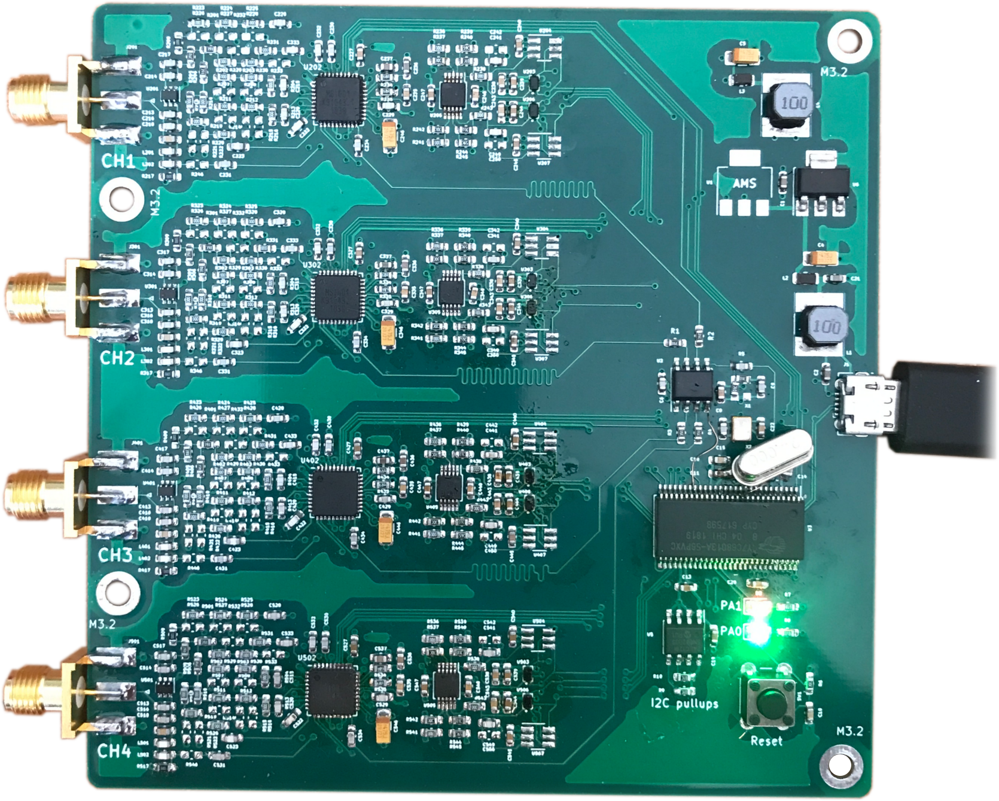
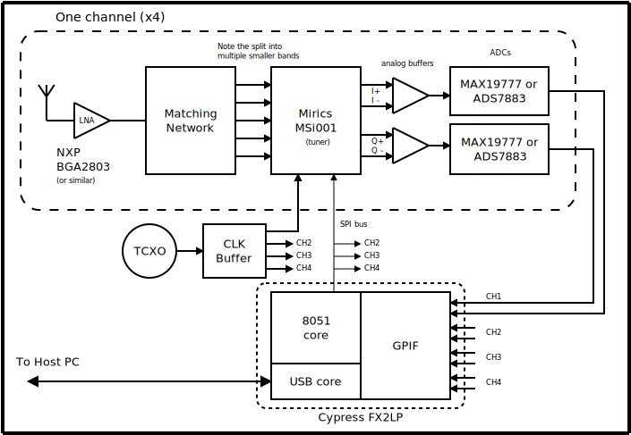
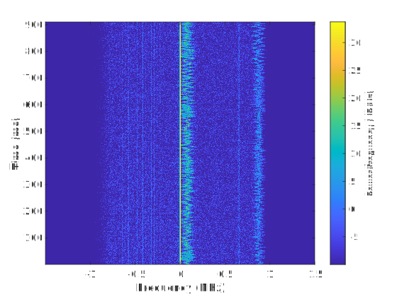
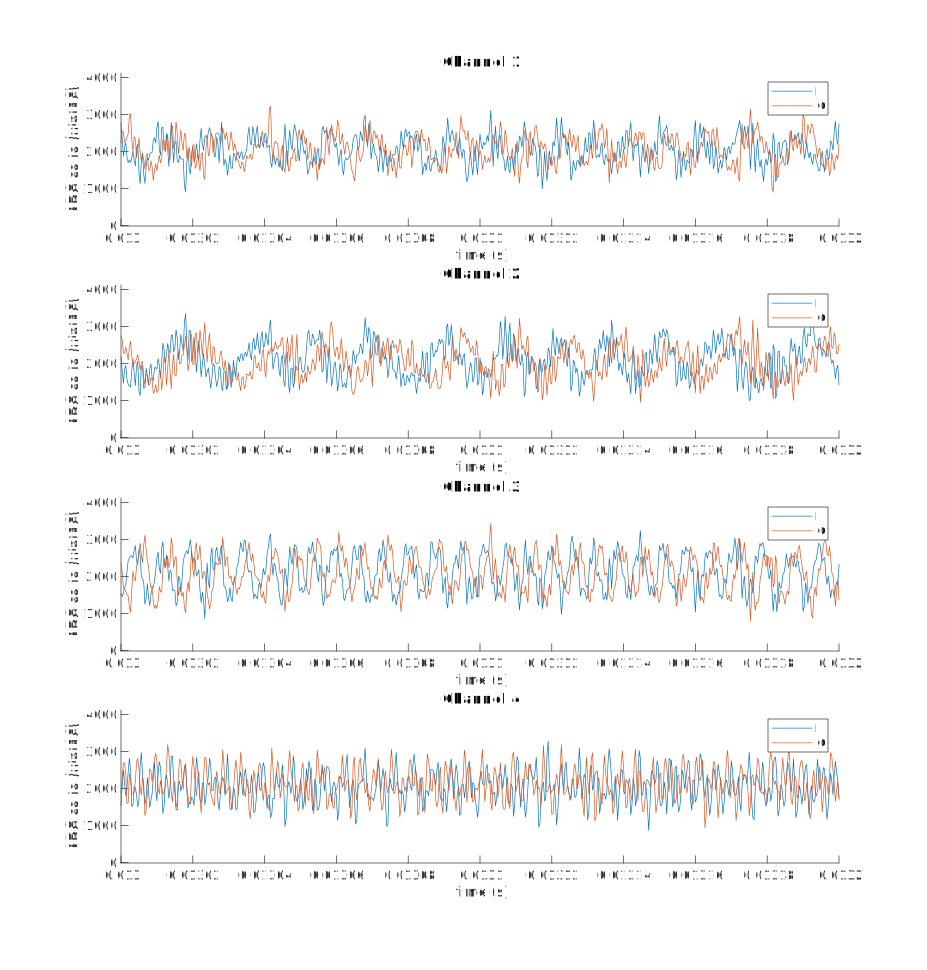

# Narrowband-SDR
A four-channel narrowband SDR receiver based around the Mirics MSi001, Maxim MAX19777 and Cypress FX2LP.

|  |  |
|---|---|
|  |  |

## Project Layout
* Simulations of the RF architecture are in the **simulations/** folder.
* KiCAD PCB designs are in the **pcb/** folder.
* Firmware running on the Cypress FX2LP is stored in the **fx2fw/fx2sdr** folder. A copy of fx2lib is also included, which the firmware is built on, and fx2lib also provides utilities to upload/program the firmware to the device (fx2load).
* A branch of GNURadio (WiP) with support for this SDR is under development in the **host/** folder. However, at present data is pulled off the SDR and stored into raw files for later analysis using a tool in **fx2fw/uhd_driver**.

## Dependencies
fx2lib has a few dependencies, which are needed to compile the firmware:
* make
* gcc
* libusb-1.0
* SDCC
* python 2.7
* swig

Having libusb installed will also allow the host utility to be compiled.

## Acknowledgements
I would  like  to  thank Dr  Emanuele  Viterbo, of Monash University’s ECSE faculty, who supervised the project at its inception and assisted in developing its scope.

The open source Sigrok project must be acknowledged for serving as an example of how to use the FX2LP at the core of this SDR for high speed data acquisition.  Similarly, the Osmocom project, which provides a driver for the tuners used in this SDR, has assisted with interfacing and configuring the MSi001 tuners used in this project.

[Antti's LinuxTV Blog](http://blog.palosaari.fi/2013/10/naked-hardware-13-logitec-ldt-1s310uj.html) provided pictures of the PCB of an actual MSi001 implementation which were vital to developing the schematics for this project.

## Further Documentation
For more details on the project, see the [final report](deliverables/FYP_report_final.pdf).
